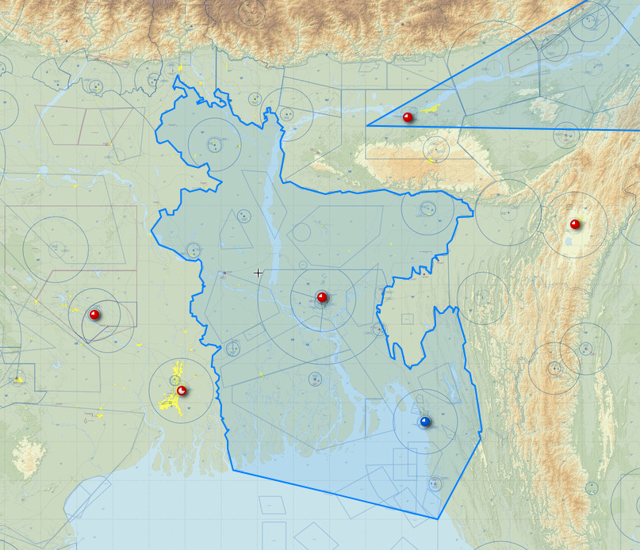
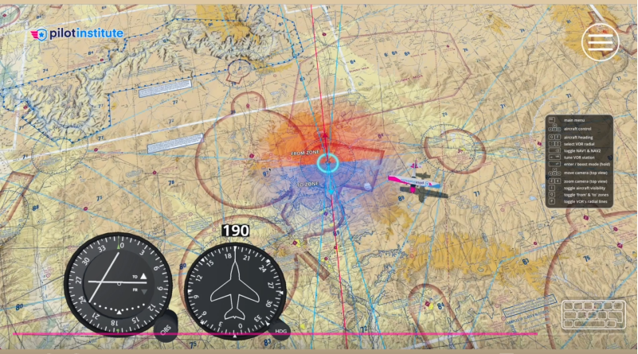
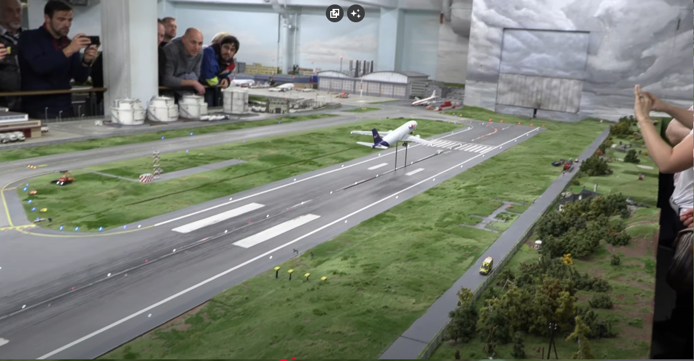

### Asset: Analogical Flight Instruments
#### https://assetstore.unity.com/packages/tools/gui/analogical-flight-instruments-gui-code-152685
###### A Unity asset for flight instrument GUIs.
This Unity asset demonstrates how to separate instrument logic from its visual representation. While built for Unity and C#, the same principles apply here. Our JavaScript `Aircraft` class holds the state (speed, altitude), and a rendering module (like `display.js`) could use that data to drive similar-looking SVG or Canvas-based gauges, creating a more immersive cockpit feel.

---

### SkyVector: Aeronautical Charts
#### https://skyvector.com/
###### Real-time aeronautical charts and flight planning.
SkyVector provides real-time, interactive aeronautical charts. It's a fantastic reference for how professional flight planning tools visualize airspace, waypoints, and routes. This serves as a benchmark for the level of detail and functionality a web-based aviation tool can achieve.

---

### VOR Simulator App
#### https://hub.pilotinstitute.com/vor-app
###### Interactive VOR simulator for pilot training.
An excellent example of a focused, single-purpose training tool from the Pilot Institute. It shows how a complex concept like VOR navigation can be broken down into an interactive, web-based simulation. This inspires the modularity of our own simulator features.

---

### DIY Arduino Radar
#### https://www.youtube.com/watch?v=5tJn6MSwhFA
###### A project linking Arduino and Processing.
This YouTube project is a direct inspiration for the 'Physical Simulator' idea. It demonstrates how an Arduino and a simple processing sketch can create a physical representation of radar data, proving the core concept of linking software to hardware for a tangible simulation experience.